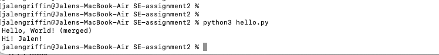

# SE-assignment2

## Overview
This project is a simple program that prints **"Hello, World!"** and 
adds a personalized greeting using my name.  

It was created as part of the *Software Engineering Assignment #2* to demonstrate
GitHub version control features including: commits, branches, pull requests, 
conflict resolution, and documentation.

## Installation
To download this repository and run the program locally, use the following commands:

```bash
# Clone the repository
git clone https://github.com/JayGriff7/SE-assignment2.git
cd SE-assignment2
```

## Example Output

Below is a screenshot of the program running successfully:



## How to Run


### Python

python3 hello.py   #will prompt: "Please enter your name:"


