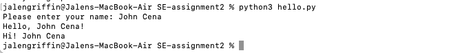

# SE-assignment2

## Overview
This project is a simple program that prints **"Hello, World!"** and 
adds a personalized greeting using my name.  

It was created as part of the *Software Engineering Assignment #2* to demonstrate
GitHub version control features including: commits, branches, pull requests, 
conflict resolution, and documentation.

## Installation
To download this repository and run the program locally, use the following commands:

```bash
# Clone the repository
git clone https://github.com/JayGriff7/SE-assignment2.git
cd SE-assignment2
```

## Example Output

Below is a screenshot of the program running successfully:



## How to Run


### Python
```bash
python3 hello.py   #will prompt: "Please enter your name:"
```

### Python

python3 hello.py   #will prompt: "Please enter your name:"


When you run the program, it will prompt you to enter your name:
Please enter your name:

After entering your name, it will respond with a personalized message such as:

Hello, Jalen!
Hi! Jalen

If you press Enter without typing anything, it will automatically use a default name ("Jalen") and still print the greetings.


## Branching & Workflow

Feature branches created: feature-1, feature-2, feature-user-input

Pull requests used to merge new features into main
Merge conflicts simulated and resolved manually in Part 5

## Issues

Issue #1: Improve README with screenshot and run instructions (Closed)
Issue #2: Add user input feature to personalize greeting (Closed)

## Contributors

Jalen Griffin (@JayGriff7)

## License

This project was created for educational purposes as part of CINS 5318 - Software Engineering (Fall 2025).